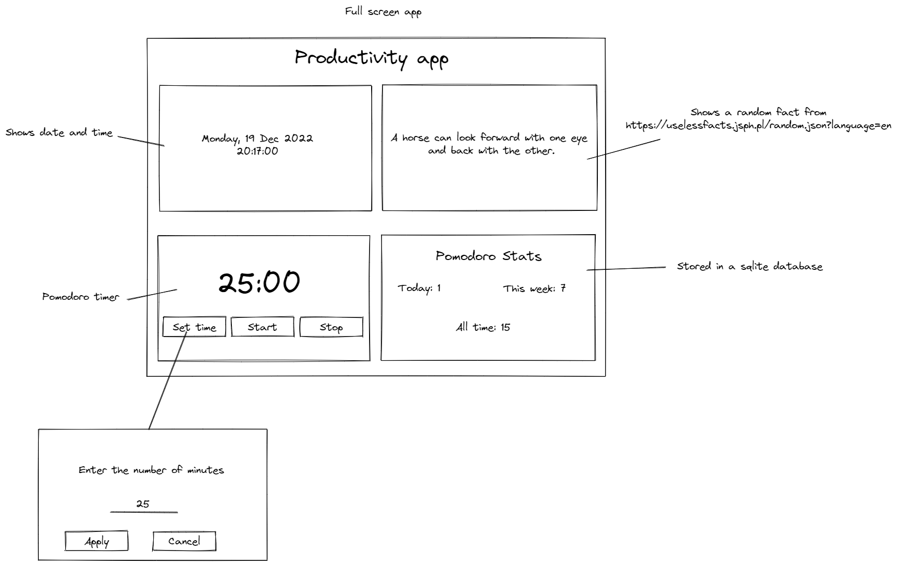

# Productivity app

Small TUI application.

## Run the application

```sh
go run main.go
```

## Build the application

```sh
go build -o productivity-app.exe main.go
```

## Application structure



## Author

- Mihai Ionut Vilcu

- [github/ionutvmi](https://github.com/ionutvmi)
- [twitter/mihai_vlc](http://twitter.com/mihai_vlc)

### References

- https://pkg.go.dev/github.com/charmbracelet/bubbletea
- https://github.com/charmbracelet/bubbletea/tree/master/examples
- https://gitlab.com/cznic/sqlite
